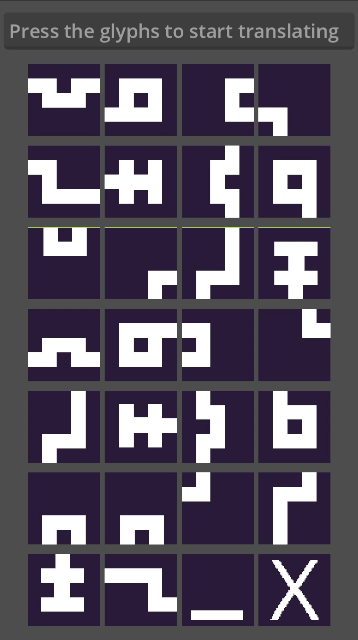

# Fezlyph - A simple FEZ glyph translator

I started playing [Fez](https://www.fezgame.com/) again and needed a way to quickly translate the secret glyph language.  
Most websites I found were either full of spam or not mobile friendly, so I quickly made this.  

It's extremely basic, but it gets the job done.  

## Tooling 

 - [Godot 4.3](https://godotengine.org/)
 - [AseSprite](https://www.aseprite.org/)

 